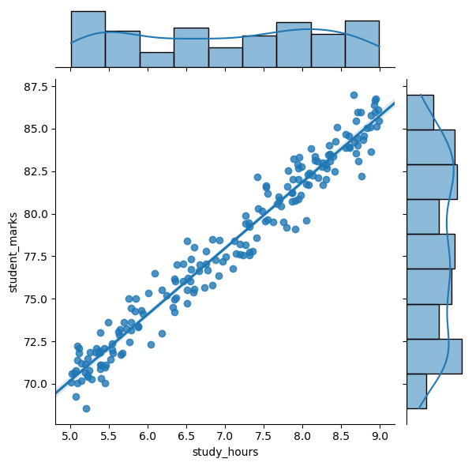
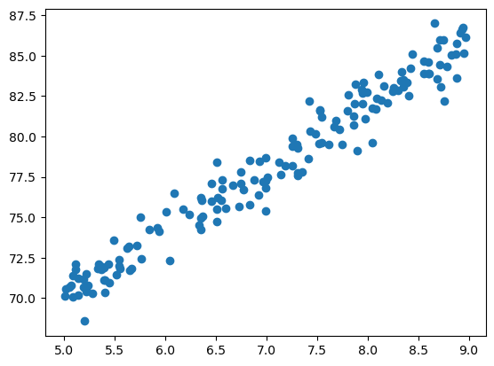
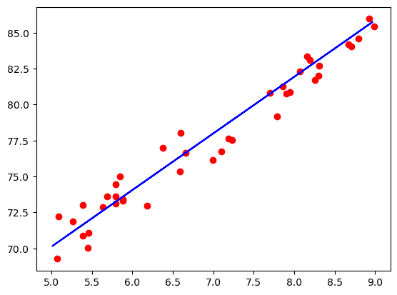

# importing the necessary libraries and loading the data set file


```python
import pandas as pd
import numpy as np
import seaborn as sns
import matplotlib.pyplot as plt

df=pd.read_csv(r"C:\Users\KARTIKI\Downloads\student_info.csv")
df
```


<div>
<style scoped>
    .dataframe tbody tr th:only-of-type {
        vertical-align: middle;
    }

    .dataframe tbody tr th {
        vertical-align: top;
    }

    .dataframe thead th {
        text-align: right;
    }
</style>
<table border="1" class="dataframe">
  <thead>
    <tr style="text-align: right;">
      <th></th>
      <th>study_hours</th>
      <th>student_marks</th>
    </tr>
  </thead>
  <tbody>
    <tr>
      <th>0</th>
      <td>6.83</td>
      <td>78.50</td>
    </tr>
    <tr>
      <th>1</th>
      <td>6.56</td>
      <td>76.74</td>
    </tr>
    <tr>
      <th>2</th>
      <td>NaN</td>
      <td>78.68</td>
    </tr>
    <tr>
      <th>3</th>
      <td>5.67</td>
      <td>71.82</td>
    </tr>
    <tr>
      <th>4</th>
      <td>8.67</td>
      <td>84.19</td>
    </tr>
    <tr>
      <th>...</th>
      <td>...</td>
      <td>...</td>
    </tr>
    <tr>
      <th>195</th>
      <td>7.53</td>
      <td>81.67</td>
    </tr>
    <tr>
      <th>196</th>
      <td>8.56</td>
      <td>84.68</td>
    </tr>
    <tr>
      <th>197</th>
      <td>8.94</td>
      <td>86.75</td>
    </tr>
    <tr>
      <th>198</th>
      <td>6.60</td>
      <td>78.05</td>
    </tr>
    <tr>
      <th>199</th>
      <td>8.35</td>
      <td>83.50</td>
    </tr>
  </tbody>
</table>
<p>200 rows × 2 columns</p>
</div>


```python
df.head()
```


<div>
<style scoped>
    .dataframe tbody tr th:only-of-type {
        vertical-align: middle;
    }

    .dataframe tbody tr th {
        vertical-align: top;
    }

    .dataframe thead th {
        text-align: right;
    }
</style>
<table border="1" class="dataframe">
  <thead>
    <tr style="text-align: right;">
      <th></th>
      <th>study_hours</th>
      <th>student_marks</th>
    </tr>
  </thead>
  <tbody>
    <tr>
      <th>0</th>
      <td>6.83</td>
      <td>78.50</td>
    </tr>
    <tr>
      <th>1</th>
      <td>6.56</td>
      <td>76.74</td>
    </tr>
    <tr>
      <th>2</th>
      <td>NaN</td>
      <td>78.68</td>
    </tr>
    <tr>
      <th>3</th>
      <td>5.67</td>
      <td>71.82</td>
    </tr>
    <tr>
      <th>4</th>
      <td>8.67</td>
      <td>84.19</td>
    </tr>
  </tbody>
</table>
</div>


```python
df.tail()
```


<div>
<style scoped>
    .dataframe tbody tr th:only-of-type {
        vertical-align: middle;
    }

    .dataframe tbody tr th {
        vertical-align: top;
    }

    .dataframe thead th {
        text-align: right;
    }
</style>
<table border="1" class="dataframe">
  <thead>
    <tr style="text-align: right;">
      <th></th>
      <th>study_hours</th>
      <th>student_marks</th>
    </tr>
  </thead>
  <tbody>
    <tr>
      <th>195</th>
      <td>7.53</td>
      <td>81.67</td>
    </tr>
    <tr>
      <th>196</th>
      <td>8.56</td>
      <td>84.68</td>
    </tr>
    <tr>
      <th>197</th>
      <td>8.94</td>
      <td>86.75</td>
    </tr>
    <tr>
      <th>198</th>
      <td>6.60</td>
      <td>78.05</td>
    </tr>
    <tr>
      <th>199</th>
      <td>8.35</td>
      <td>83.50</td>
    </tr>
  </tbody>
</table>
</div>


```python
df.isnull().sum()
```


    study_hours      5
    student_marks    0
    dtype: int64


```python
df.describe()
```


<div>
<style scoped>
    .dataframe tbody tr th:only-of-type {
        vertical-align: middle;
    }

    .dataframe tbody tr th {
        vertical-align: top;
    }

    .dataframe thead th {
        text-align: right;
    }
</style>
<table border="1" class="dataframe">
  <thead>
    <tr style="text-align: right;">
      <th></th>
      <th>study_hours</th>
      <th>student_marks</th>
    </tr>
  </thead>
  <tbody>
    <tr>
      <th>count</th>
      <td>195.000000</td>
      <td>200.00000</td>
    </tr>
    <tr>
      <th>mean</th>
      <td>6.995949</td>
      <td>77.93375</td>
    </tr>
    <tr>
      <th>std</th>
      <td>1.253060</td>
      <td>4.92570</td>
    </tr>
    <tr>
      <th>min</th>
      <td>5.010000</td>
      <td>68.57000</td>
    </tr>
    <tr>
      <th>25%</th>
      <td>5.775000</td>
      <td>73.38500</td>
    </tr>
    <tr>
      <th>50%</th>
      <td>7.120000</td>
      <td>77.71000</td>
    </tr>
    <tr>
      <th>75%</th>
      <td>8.085000</td>
      <td>82.32000</td>
    </tr>
    <tr>
      <th>max</th>
      <td>8.990000</td>
      <td>86.99000</td>
    </tr>
  </tbody>
</table>
</div>


```python
df.info()
```

    <class 'pandas.core.frame.DataFrame'>
    RangeIndex: 200 entries, 0 to 199
    Data columns (total 2 columns):
     #   Column         Non-Null Count  Dtype  
    ---  ------         --------------  -----  
     0   study_hours    195 non-null    float64
     1   student_marks  200 non-null    float64
    dtypes: float64(2)
    memory usage: 3.3 KB
    

# Data Visualization


```python
sns.jointplot(x="study_hours", y="student_marks", data=df,
                  kind="reg", truncate=False,
                  )
```


    <seaborn.axisgrid.JointGrid at 0x15ed359bd50>


    

    


# Prepair the Data for Machine Learning Algorithm


```python
#Cleaning the Data
```


```python
df.isnull().sum()
```


    study_hours      0
    student_marks    0
    dtype: int64


```python
avg=df["study_hours"].mean()
```


```python
avg
```


    6.9959487179487185


```python
df=df.fillna(avg)
```


```python
df.head()
```


<div>
<style scoped>
    .dataframe tbody tr th:only-of-type {
        vertical-align: middle;
    }

    .dataframe tbody tr th {
        vertical-align: top;
    }

    .dataframe thead th {
        text-align: right;
    }
</style>
<table border="1" class="dataframe">
  <thead>
    <tr style="text-align: right;">
      <th></th>
      <th>study_hours</th>
      <th>student_marks</th>
    </tr>
  </thead>
  <tbody>
    <tr>
      <th>0</th>
      <td>6.830000</td>
      <td>78.50</td>
    </tr>
    <tr>
      <th>1</th>
      <td>6.560000</td>
      <td>76.74</td>
    </tr>
    <tr>
      <th>2</th>
      <td>6.995949</td>
      <td>78.68</td>
    </tr>
    <tr>
      <th>3</th>
      <td>5.670000</td>
      <td>71.82</td>
    </tr>
    <tr>
      <th>4</th>
      <td>8.670000</td>
      <td>84.19</td>
    </tr>
  </tbody>
</table>
</div>


# Split the Dataset


```python
x=df.drop("student_marks",axis=1)
y=df.drop("study_hours",axis=1)
print("shape of x=",x.shape,"\n","shape of y=",y.shape)
```

    shape of x= (200, 1) 
     shape of y= (200, 1)
    

# importing Machine learning models and lib


```python
from sklearn.model_selection import train_test_split
x_train,x_test,y_train,y_test=train_test_split(x,y,test_size=0.2,random_state=51)
print("x train ",x_train.shape)
print("y train ",y_train.shape)
print("x test ",x_test.shape)
print("x test ",y_test.shape)
```

    x train  (160, 1)
    y train  (160, 1)
    x test  (40, 1)
    x test  (40, 1)
    

# select a model and train it


```python
#y=m*x+c
from sklearn.linear_model import LinearRegression
lr=LinearRegression()
```


```python
lr.fit(x_train,y_train)
```


<style>#sk-container-id-2 {color: black;}#sk-container-id-2 pre{padding: 0;}#sk-container-id-2 div.sk-toggleable {background-color: white;}#sk-container-id-2 label.sk-toggleable__label {cursor: pointer;display: block;width: 100%;margin-bottom: 0;padding: 0.3em;box-sizing: border-box;text-align: center;}#sk-container-id-2 label.sk-toggleable__label-arrow:before {content: "▸";float: left;margin-right: 0.25em;color: #696969;}#sk-container-id-2 label.sk-toggleable__label-arrow:hover:before {color: black;}#sk-container-id-2 div.sk-estimator:hover label.sk-toggleable__label-arrow:before {color: black;}#sk-container-id-2 div.sk-toggleable__content {max-height: 0;max-width: 0;overflow: hidden;text-align: left;background-color: #f0f8ff;}#sk-container-id-2 div.sk-toggleable__content pre {margin: 0.2em;color: black;border-radius: 0.25em;background-color: #f0f8ff;}#sk-container-id-2 input.sk-toggleable__control:checked~div.sk-toggleable__content {max-height: 200px;max-width: 100%;overflow: auto;}#sk-container-id-2 input.sk-toggleable__control:checked~label.sk-toggleable__label-arrow:before {content: "▾";}#sk-container-id-2 div.sk-estimator input.sk-toggleable__control:checked~label.sk-toggleable__label {background-color: #d4ebff;}#sk-container-id-2 div.sk-label input.sk-toggleable__control:checked~label.sk-toggleable__label {background-color: #d4ebff;}#sk-container-id-2 input.sk-hidden--visually {border: 0;clip: rect(1px 1px 1px 1px);clip: rect(1px, 1px, 1px, 1px);height: 1px;margin: -1px;overflow: hidden;padding: 0;position: absolute;width: 1px;}#sk-container-id-2 div.sk-estimator {font-family: monospace;background-color: #f0f8ff;border: 1px dotted black;border-radius: 0.25em;box-sizing: border-box;margin-bottom: 0.5em;}#sk-container-id-2 div.sk-estimator:hover {background-color: #d4ebff;}#sk-container-id-2 div.sk-parallel-item::after {content: "";width: 100%;border-bottom: 1px solid gray;flex-grow: 1;}#sk-container-id-2 div.sk-label:hover label.sk-toggleable__label {background-color: #d4ebff;}#sk-container-id-2 div.sk-serial::before {content: "";position: absolute;border-left: 1px solid gray;box-sizing: border-box;top: 0;bottom: 0;left: 50%;z-index: 0;}#sk-container-id-2 div.sk-serial {display: flex;flex-direction: column;align-items: center;background-color: white;padding-right: 0.2em;padding-left: 0.2em;position: relative;}#sk-container-id-2 div.sk-item {position: relative;z-index: 1;}#sk-container-id-2 div.sk-parallel {display: flex;align-items: stretch;justify-content: center;background-color: white;position: relative;}#sk-container-id-2 div.sk-item::before, #sk-container-id-2 div.sk-parallel-item::before {content: "";position: absolute;border-left: 1px solid gray;box-sizing: border-box;top: 0;bottom: 0;left: 50%;z-index: -1;}#sk-container-id-2 div.sk-parallel-item {display: flex;flex-direction: column;z-index: 1;position: relative;background-color: white;}#sk-container-id-2 div.sk-parallel-item:first-child::after {align-self: flex-end;width: 50%;}#sk-container-id-2 div.sk-parallel-item:last-child::after {align-self: flex-start;width: 50%;}#sk-container-id-2 div.sk-parallel-item:only-child::after {width: 0;}#sk-container-id-2 div.sk-dashed-wrapped {border: 1px dashed gray;margin: 0 0.4em 0.5em 0.4em;box-sizing: border-box;padding-bottom: 0.4em;background-color: white;}#sk-container-id-2 div.sk-label label {font-family: monospace;font-weight: bold;display: inline-block;line-height: 1.2em;}#sk-container-id-2 div.sk-label-container {text-align: center;}#sk-container-id-2 div.sk-container {/* jupyter's `normalize.less` sets `[hidden] { display: none; }` but bootstrap.min.css set `[hidden] { display: none !important; }` so we also need the `!important` here to be able to override the default hidden behavior on the sphinx rendered scikit-learn.org. See: https://github.com/scikit-learn/scikit-learn/issues/21755 */display: inline-block !important;position: relative;}#sk-container-id-2 div.sk-text-repr-fallback {display: none;}</style><div id="sk-container-id-2" class="sk-top-container"><div class="sk-text-repr-fallback"><pre>LinearRegression()</pre><b>In a Jupyter environment, please rerun this cell to show the HTML representation or trust the notebook. <br />On GitHub, the HTML representation is unable to render, please try loading this page with nbviewer.org.</b></div><div class="sk-container" hidden><div class="sk-item"><div class="sk-estimator sk-toggleable"><input class="sk-toggleable__control sk-hidden--visually" id="sk-estimator-id-2" type="checkbox" checked><label for="sk-estimator-id-2" class="sk-toggleable__label sk-toggleable__label-arrow">LinearRegression</label><div class="sk-toggleable__content"><pre>LinearRegression()</pre></div></div></div></div></div>


```python
lr.coef_
```


    array([[3.93571802]])


```python
lr.intercept_
```


    array([50.44735504])


```python
m=3.93571802
c=50.44735504
y=m*4+c
y
```


    66.19022712


```python
lr.predict([[4]])[0][0].round(2)
```

    C:\Users\KARTIKI\anaconda3\Lib\site-packages\sklearn\base.py:464: UserWarning: X does not have valid feature names, but LinearRegression was fitted with feature names
      warnings.warn(
    


    66.19


```python
y_pred=lr.predict(x_test)
y_pred
```


    array([[83.11381458],
           [78.9025963 ],
           [84.57003024],
           [85.82946001],
           [84.72745896],
           [80.75238377],
           [72.84159055],
           [71.66087515],
           [73.23516235],
           [71.66087515],
           [73.47130543],
           [76.38373677],
           [73.23516235],
           [73.58937697],
           [82.95638585],
           [70.40144538],
           [73.23516235],
           [78.74516758],
           [75.55723598],
           [82.68088559],
           [76.65923703],
           [70.48015974],
           [74.77009238],
           [77.98143645],
           [85.59331693],
           [82.56281405],
           [76.42309395],
           [85.0423164 ],
           [78.39095296],
           [81.38209865],
           [81.73631327],
           [83.15317176],
           [82.20859943],
           [81.10659839],
           [73.58937697],
           [71.1492318 ],
           [71.89701823],
           [81.53952737],
           [72.60544747],
           [71.93637541]])


```python
pd.DataFrame(np.c_[x_test,y_test,y_pred],columns=["stud_hours","stud_original_marks","stud_predicted_marks"])
```


<div>
<style scoped>
    .dataframe tbody tr th:only-of-type {
        vertical-align: middle;
    }

    .dataframe tbody tr th {
        vertical-align: top;
    }

    .dataframe thead th {
        text-align: right;
    }
</style>
<table border="1" class="dataframe">
  <thead>
    <tr style="text-align: right;">
      <th></th>
      <th>stud_hours</th>
      <th>stud_original_marks</th>
      <th>stud_predicted_marks</th>
    </tr>
  </thead>
  <tbody>
    <tr>
      <th>0</th>
      <td>8.300000</td>
      <td>82.02</td>
      <td>83.113815</td>
    </tr>
    <tr>
      <th>1</th>
      <td>7.230000</td>
      <td>77.55</td>
      <td>78.902596</td>
    </tr>
    <tr>
      <th>2</th>
      <td>8.670000</td>
      <td>84.19</td>
      <td>84.570030</td>
    </tr>
    <tr>
      <th>3</th>
      <td>8.990000</td>
      <td>85.46</td>
      <td>85.829460</td>
    </tr>
    <tr>
      <th>4</th>
      <td>8.710000</td>
      <td>84.03</td>
      <td>84.727459</td>
    </tr>
    <tr>
      <th>5</th>
      <td>7.700000</td>
      <td>80.81</td>
      <td>80.752384</td>
    </tr>
    <tr>
      <th>6</th>
      <td>5.690000</td>
      <td>73.61</td>
      <td>72.841591</td>
    </tr>
    <tr>
      <th>7</th>
      <td>5.390000</td>
      <td>70.90</td>
      <td>71.660875</td>
    </tr>
    <tr>
      <th>8</th>
      <td>5.790000</td>
      <td>73.14</td>
      <td>73.235162</td>
    </tr>
    <tr>
      <th>9</th>
      <td>5.390000</td>
      <td>73.02</td>
      <td>71.660875</td>
    </tr>
    <tr>
      <th>10</th>
      <td>5.850000</td>
      <td>75.02</td>
      <td>73.471305</td>
    </tr>
    <tr>
      <th>11</th>
      <td>6.590000</td>
      <td>75.37</td>
      <td>76.383737</td>
    </tr>
    <tr>
      <th>12</th>
      <td>5.790000</td>
      <td>74.44</td>
      <td>73.235162</td>
    </tr>
    <tr>
      <th>13</th>
      <td>5.880000</td>
      <td>73.40</td>
      <td>73.589377</td>
    </tr>
    <tr>
      <th>14</th>
      <td>8.260000</td>
      <td>81.70</td>
      <td>82.956386</td>
    </tr>
    <tr>
      <th>15</th>
      <td>5.070000</td>
      <td>69.27</td>
      <td>70.401445</td>
    </tr>
    <tr>
      <th>16</th>
      <td>5.790000</td>
      <td>73.64</td>
      <td>73.235162</td>
    </tr>
    <tr>
      <th>17</th>
      <td>7.190000</td>
      <td>77.63</td>
      <td>78.745168</td>
    </tr>
    <tr>
      <th>18</th>
      <td>6.380000</td>
      <td>77.01</td>
      <td>75.557236</td>
    </tr>
    <tr>
      <th>19</th>
      <td>8.190000</td>
      <td>83.08</td>
      <td>82.680886</td>
    </tr>
    <tr>
      <th>20</th>
      <td>6.660000</td>
      <td>76.63</td>
      <td>76.659237</td>
    </tr>
    <tr>
      <th>21</th>
      <td>5.090000</td>
      <td>72.22</td>
      <td>70.480160</td>
    </tr>
    <tr>
      <th>22</th>
      <td>6.180000</td>
      <td>72.96</td>
      <td>74.770092</td>
    </tr>
    <tr>
      <th>23</th>
      <td>6.995949</td>
      <td>76.14</td>
      <td>77.981436</td>
    </tr>
    <tr>
      <th>24</th>
      <td>8.930000</td>
      <td>85.96</td>
      <td>85.593317</td>
    </tr>
    <tr>
      <th>25</th>
      <td>8.160000</td>
      <td>83.36</td>
      <td>82.562814</td>
    </tr>
    <tr>
      <th>26</th>
      <td>6.600000</td>
      <td>78.05</td>
      <td>76.423094</td>
    </tr>
    <tr>
      <th>27</th>
      <td>8.790000</td>
      <td>84.60</td>
      <td>85.042316</td>
    </tr>
    <tr>
      <th>28</th>
      <td>7.100000</td>
      <td>76.76</td>
      <td>78.390953</td>
    </tr>
    <tr>
      <th>29</th>
      <td>7.860000</td>
      <td>81.24</td>
      <td>81.382099</td>
    </tr>
    <tr>
      <th>30</th>
      <td>7.950000</td>
      <td>80.86</td>
      <td>81.736313</td>
    </tr>
    <tr>
      <th>31</th>
      <td>8.310000</td>
      <td>82.69</td>
      <td>83.153172</td>
    </tr>
    <tr>
      <th>32</th>
      <td>8.070000</td>
      <td>82.30</td>
      <td>82.208599</td>
    </tr>
    <tr>
      <th>33</th>
      <td>7.790000</td>
      <td>79.17</td>
      <td>81.106598</td>
    </tr>
    <tr>
      <th>34</th>
      <td>5.880000</td>
      <td>73.34</td>
      <td>73.589377</td>
    </tr>
    <tr>
      <th>35</th>
      <td>5.260000</td>
      <td>71.86</td>
      <td>71.149232</td>
    </tr>
    <tr>
      <th>36</th>
      <td>5.450000</td>
      <td>70.06</td>
      <td>71.897018</td>
    </tr>
    <tr>
      <th>37</th>
      <td>7.900000</td>
      <td>80.76</td>
      <td>81.539527</td>
    </tr>
    <tr>
      <th>38</th>
      <td>5.630000</td>
      <td>72.87</td>
      <td>72.605447</td>
    </tr>
    <tr>
      <th>39</th>
      <td>5.460000</td>
      <td>71.10</td>
      <td>71.936375</td>
    </tr>
  </tbody>
</table>
</div>


```python
lr.score(x_test,y_test).round(3)
```


    0.951


```python
plt.scatter(x_train,y_train)
plt.show()
```


    

    


```python
plt.scatter(x_test,y_test,color="red")
plt.plot(x_train,lr.predict(x_train),color="blue")
plt.show()
```


    

    


# Save ML Model


```python
import joblib
joblib.dump(lr,"student_marks_predictor_model.pkl")
```


    ['student_marks_predictor_model.pkl']


```python
model=joblib.load("student_marks_predictor_model.pkl")
```


```python
model.predict([[5]])
```

    C:\Users\KARTIKI\anaconda3\Lib\site-packages\sklearn\base.py:464: UserWarning: X does not have valid feature names, but LinearRegression was fitted with feature names
      warnings.warn(
    


    array([[70.12594512]])


```python
model.predict([[5]])[0][0]
```

    C:\Users\KARTIKI\anaconda3\Lib\site-packages\sklearn\base.py:464: UserWarning: X does not have valid feature names, but LinearRegression was fitted with feature names
      warnings.warn(
    


    70.12594512018406


```python

```
